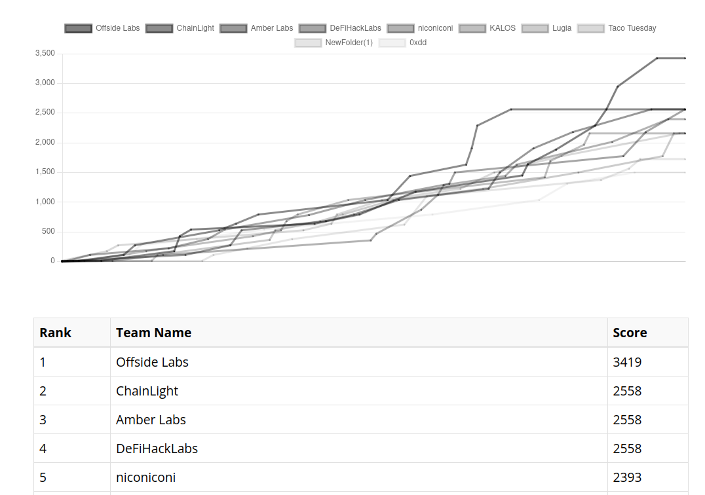

# WriteUps for the Blaz CTF 2023

Challenges can be found here : https://github.com/fuzzland/blazctf-2023/tree/main/challenges

## Challenges I solved : 

- Jambo (EVM, REVERSE) (33 solves)
- Maze (YUL) (24 solves)
- Ghost (EVM, PWN) (13 solves)

## DeFiHackLabs 

I was lucky enough to play this ctf with the `DeFiHackLabs` team (Rank 4).

Although some of my teammate solved theses challenges faster than me, and I faced difficulties with the [Missing challenge](https://github.com/fuzzland/blazctf-2023/tree/main/solutions/missing), I decided to continue working on them to maintain my mental well-being :)

